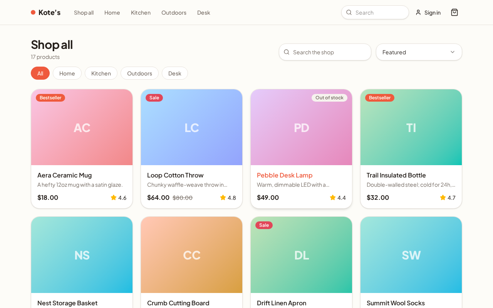

# Simulator

> A realistic, deterministic, **fully client-side** web app used as a controlled target
> for web automation and AI testing agents. A sponsored open-source project of
> **[autotests.dev](https://autotests.dev)**, hosted at
> **[simulator.autotests.dev](https://simulator.autotests.dev)**.

[](https://github.com/autotests-dev/simulator/actions/workflows/ci.yml)
[](LICENSE)
[](https://simulator.autotests.dev)

Simulator is one believable product — **Kote's**, a small online store — that looks and
behaves like a real site but is fully under control: the data is fixed, behavior is
**deterministic**, and the tricky edge cases that make automation brittle are
**deliberately baked in**. There is no "scenario catalog" and nothing that announces it
is a test target; it's just a real-feeling app you can point tools at.

It runs **entirely in the browser** — no application server, no database. "Backend"
behavior (catalog, cart math, auth, validation, errors, latency) is simulated in-browser
with a [Mock Service Worker](https://mswjs.io), so to a browser-driven agent and the
network panel it looks like a real API. It deploys to a static CDN for ~$0 and self-hosts
in minutes.

**▶ Try it live: [simulator.autotests.dev](https://simulator.autotests.dev)**

[](https://simulator.autotests.dev)

## Quickstart

```bash
pnpm install
pnpm dev          # http://localhost:5173
```

Other commands:

```bash
pnpm build        # type-check + build the static site to apps/site/dist
pnpm preview      # preview the production build on :4173
pnpm test         # Playwright regression guards (builds + previews first)
pnpm typecheck    # type-check every workspace package
pnpm lint         # ESLint (incl. determinism rules for product code)
pnpm validate     # validate simulator.config (accounts, catalog, behaviors)
pnpm msw:init     # regenerate the committed MSW worker (only after upgrading msw)
```

A [`Makefile`](Makefile) wraps these plus the container targets — run `make help` for the
full list. Enable the pre-push formatting check once with `make install-git-hooks`.

## Run with Docker

The image is a static build served by nginx — no application server, no runtime config.

```bash
make up            # build the image and serve on http://localhost:8080
make down          # stop and remove it

# ...or without make:
docker compose up -d --build

# ...or the published image (pushed on each release):
docker run --rm -p 8080:80 ghcr.io/autotests-dev/simulator:latest
```

## What's in the box

| Path                                   | What it is                                                                                                                                                                                                                             |
| -------------------------------------- | -------------------------------------------------------------------------------------------------------------------------------------------------------------------------------------------------------------------------------------- |
| [`packages/config`](packages/config)   | `simulator.config` — the typed, validated build-time data: accounts, seed catalog, and behavior assignments.                                                                                                                           |
| [`packages/sim-kit`](packages/sim-kit) | Determinism toolkit: seeded RNG, injectable clock, bounded timing, per-origin persisted state.                                                                                                                                         |
| [`packages/domain`](packages/domain)   | The deterministic "backend": cart, checkout, auth, seeded order history, reset — seeded from config, persisted to `localStorage`.                                                                                                      |
| [`packages/ui`](packages/ui)           | The Kote's design system: shadcn-style primitives themed hard (pill buttons, chunky radius, coral/stone/teal tokens).                                                                                                                  |
| [`apps/site`](apps/site)               | The deployable static app: the storefront surfaces and the MSW API.                                                                                                                                                                    |
| [`docs/`](docs)                        | [`best-practices.md`](docs/best-practices.md) (robust-testing guidance, no coordinates), [`whats-deployed.md`](docs/whats-deployed.md) (known inputs), and [`judging.md`](docs/judging.md) (the rubric for scoring a generated suite). |
| [`tests/`](tests)                      | Playwright regression guards — **not** shipped to the agent-facing site. They name concrete routes and assertions: spoilers, if you point an agent at the repo.                                                                        |

## How it works

- **Build-time config.** `simulator.config` defines the seeded accounts, catalog, and
  behavior assignments and is baked into the static bundle. Validated by `pnpm validate`.
- **Variants come from real navigation.** Localized behavior is a **route** (an
  out-of-stock product, a consent overlay on the landing page); cross-cutting behavior is
  an **account** (a slow connection, a large order history, a `de-DE` locale).
- **A benign baseline, adverse accounts.** Guests and the baseline account
  (`demo@kotes.test`) run under benign conditions; each **condition account** switches on
  one adversity — slow or flaky network, another locale, a step-up re-auth, an expiring
  session. Generate tests against the baseline with **parametrized credentials**, then
  re-run the same suite per account: the diff is your robustness report. See
  [`docs/whats-deployed.md`](docs/whats-deployed.md).
- **Shared state.** All surfaces read and write one per-origin domain layer. A fresh
  browser context (or `?reset=1`) re-seeds the baseline.
- **No oracle.** Ground truth is the repo's [`docs/best-practices.md`](docs/best-practices.md)
  — pitfall _kinds_ and robust habits, never _where_ they live. To score a generated
  suite, a human or AI judge applies [`docs/judging.md`](docs/judging.md) to the
  account-matrix results.

## Pitfalls exercised (family-level)

Locator (repeated text, hidden responsive duplicates), visibility (disabled states,
availability inference), async (delayed updates, slow networks), state (clean session,
step-up re-auth, session expiry), domain (pricing thresholds, inventory, invalid no-ops),
forms (submit validation, conditional fields), navigation (pagination), responsive, and
locale formatting. See
[`docs/best-practices.md`](docs/best-practices.md). The known inputs (accounts, promo
codes) are in [`docs/whats-deployed.md`](docs/whats-deployed.md).

## Deploy

`pnpm build` emits a static bundle to `apps/site/dist` — host it anywhere that serves
files over HTTP(S) (it registers a service worker, so `file://` won't do). Any of:

- **A static host / CDN** — Cloudflare Pages, Netlify, GitHub Pages, S3+CloudFront, etc.
  SPA deep links need an `/* → /index.html` rewrite; `apps/site/public/_redirects` already
  provides it for Pages/Netlify.
- **The container** — `ghcr.io/autotests-dev/simulator` (nginx serving the build with the
  rewrite baked in). See [Run with Docker](#run-with-docker).

The live target uses **Cloudflare Pages**; pushing a `vX.Y.Z` tag publishes the image to
GHCR and deploys the build (see [`.github/workflows/release.yml`](.github/workflows/release.yml)).

## Self-hosting / your own target

Fork the repo, edit [`packages/config/src/simulator.config.ts`](packages/config/src/simulator.config.ts)
(accounts, catalog, behavior assignments), `pnpm build`, and deploy. New pages or new
behavior _kinds_ are code contributions; everything else is config. For how the pieces fit
together, see [`docs/architecture.md`](docs/architecture.md); to contribute, see
[CONTRIBUTING.md](CONTRIBUTING.md).

## Docs

- [`docs/architecture.md`](docs/architecture.md) — how the static app fakes a backend.
- [`docs/best-practices.md`](docs/best-practices.md) — pitfall families and robust habits.
- [`docs/whats-deployed.md`](docs/whats-deployed.md) — the known inputs (accounts, codes).
- [`docs/judging.md`](docs/judging.md) — rubric for scoring a generated suite.
- [`SECURITY.md`](SECURITY.md) · [`CONTRIBUTING.md`](CONTRIBUTING.md)

## License

[Apache-2.0](LICENSE).
